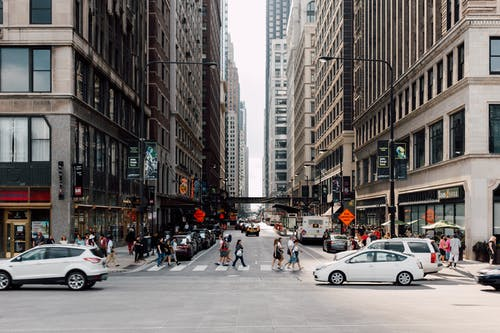

# Image Segmentation using YOLOV5




## How to setup ?
```bash
python -m pip install -r requirements.txt
```

> How to run ?
```
usage: main.py [-h] --img IMG
python video_segment.py --source [vid or camera source]

```
```
options:
  -h, --help  show this help message and exit
  --img IMG   Image path or link
  --source SOURCE Video or camera source
```